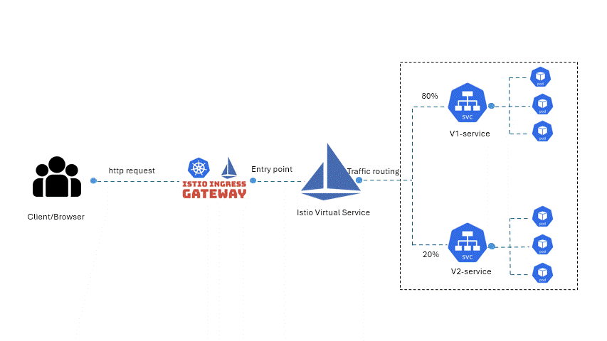
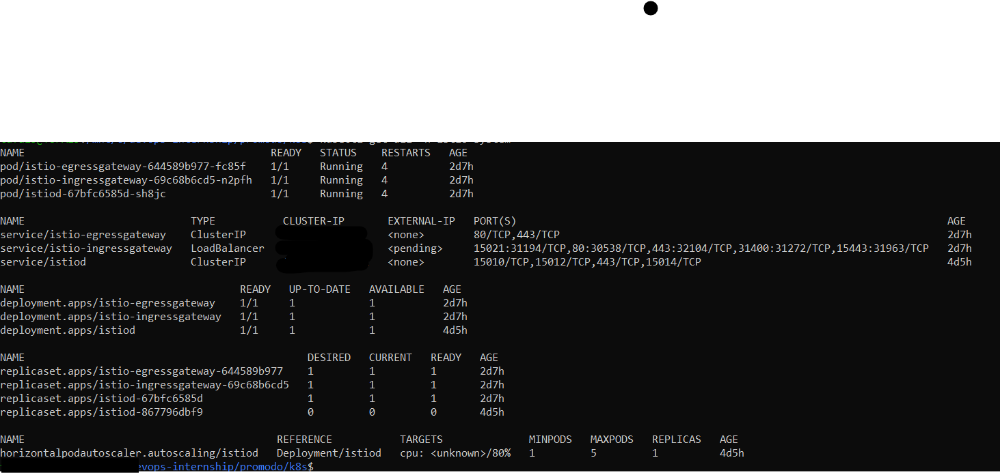
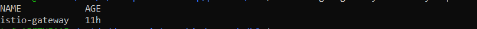
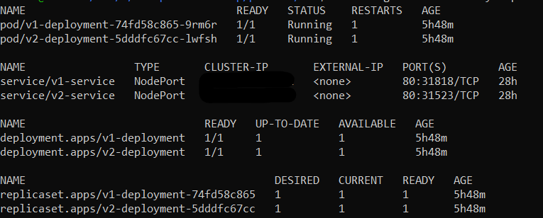
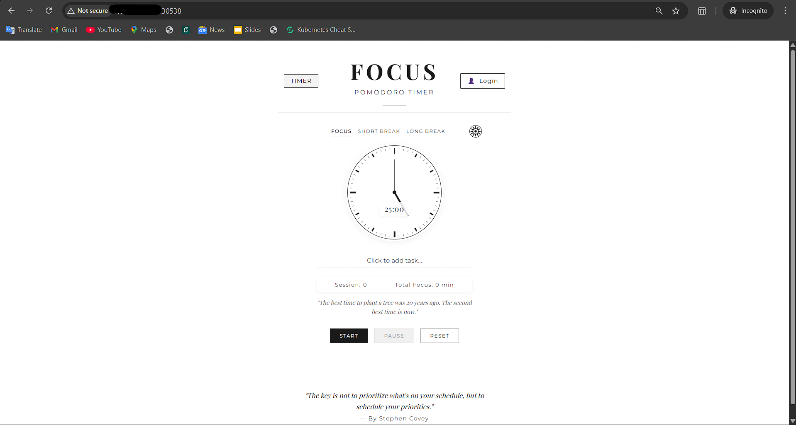
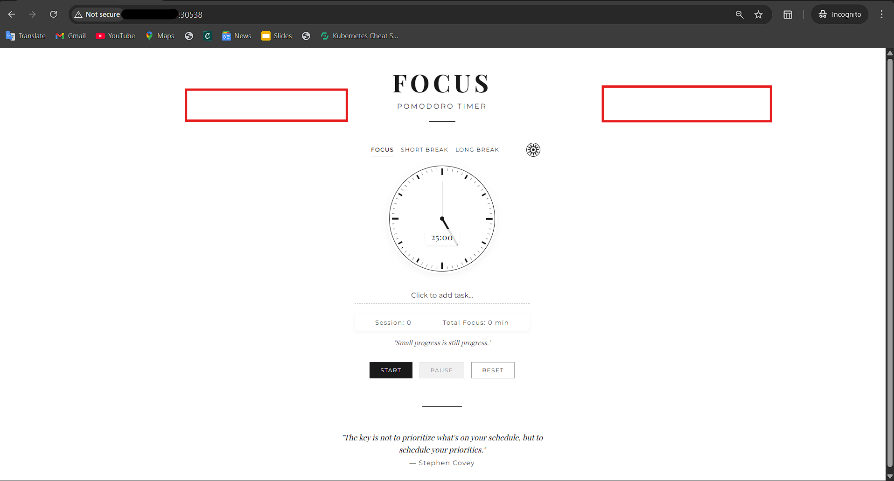

<h1 align="center">⏱️ Promodo Timer Canary Deployment</h1>

<p align="center">
  <em>A cloud-native <b>Canary Deployment</b> simulation using <b>Kubernetes</b> and <b>Istio</b></em>  
</p>

<p align="center">
  
  
  
  
  
</p>

---

## ✨ Overview
This project demonstrates **modern canary deployment strategies** using **Istio** on a lightweight **Kubernetes cluster (MicroK8s/K3s)**.  

It deploys a **Node.js + React (Vite) timer app**, served with **Nginx**, while safely splitting traffic between multiple versions:  

- 🟢 **v1** → Stable version (**80% traffic**)  
- 🔵 **v2** → Canary version (**20% traffic**)  

This mirrors **real-world production rollouts**, where new features are introduced gradually with **minimal risk**.

---

## 📖 Deployment Flow

<p align="center">
  
</p>

## 🚀 Features
- ☸️ Lightweight **MicroK8s / K3s** Kubernetes setup  
- 🛡 **Istio service mesh** for routing & observability  
- 🔀 **Canary traffic routing** with weighted distribution  
- ⚛ **SPA-friendly React app** with hashed assets  
- 🌐 Configured **Gateway + VirtualService + DestinationRule**  
- 📦 **Dockerized deployments** served by Nginx  
- 🧪 Perfect for **learning blue/green & canary deployment patterns**  

---

## 🛠️ Tech Stack
| Tool         | Usage |
|--------------|---------------------------------------------------|
| 🐳 **Docker** | Containerization of v1 and v2 apps |
| ⚛ **React + Vite** | Frontend timer app |
| 🟢 **Node.js** | Backend (optional for APIs) |
| ☸️ **Kubernetes (MicroK8s / K3s)** | Cluster environment |
| 🔹 **Istio** | Service mesh & traffic control |
| ⛵ **Helm** | Optional for Istio setup |

---

## 📂 Project Structure
```bash
promodo-timer/
│
├── k8s/
│   ├── v1-deployment.yml       # Deployment for stable app
│   ├── v2-deployment.yml       # Deployment for canary app
│   ├── v1-service.yml          # Kubernetes Service for v1
│   ├── v2-service.yml          # Kubernetes Service for v2
│   ├── virtual-service.yml     # Istio VirtualService
│   └── gateway.yml             # Istio Gateway
│
│── nginx.conf              # Nginx config for static assets
│
├── src/        # React/Vite source code
├── dist/       # Built assets
├── package.json
└── README.md

```

----------


## ⚡ Quick Start

### 1️⃣ Clone repo

```bash
git clone https://github.com/your-username/promodo-timer.git
cd promodo-timer

```

### 2️⃣ Build Docker images

```bash
docker build -t promodo-timer:v1 -f docker/Dockerfile.v1 .
docker build -t promodo-timer:v2 -f docker/Dockerfile.v2 .

```

### 3️⃣ Deploy to Kubernetes

```bash
kubectl apply -f k8s/

```

### 4️⃣ Access app via Istio Gateway

```bash
kubectl get svc istio-ingressgateway -n istio-system

```

Open the **External IP** in your browser 🎉

----------

## 📸 Demo (Optional)

## 📸 Visuals & Demo

### 🔹 Istio Components
<p align="center">
  
</p>

### 🔹 Gateway & Virtual Service
<p align="center">
  
  
</p>

### 🔹 Kubernetes Deployments
<p align="center">
  
</p>

### 🔹 Application Demo

#### 🟢 Version 1 (Stable – 80% Traffic)
<p align="center">
  
</p>

#### 🔵 Version 2 (Canary – 20% Traffic)
<p align="center">
  
</p>


----------

## 👨‍💻 Author

💡 **Kartik Naik** – Cloud & DevOps Enthusiast 🚀

